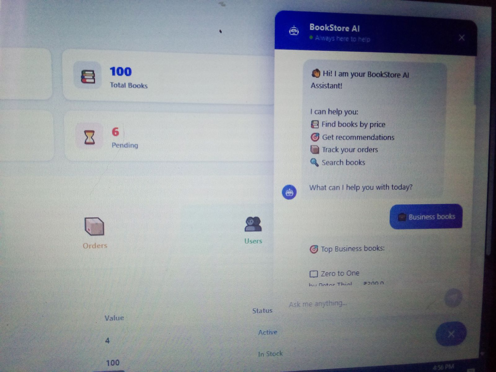

# 📚 Bookstore Application

A full-stack **Bookstore Web Application** built using **React, Redux, Spring Boot, and MySQL**.  
This application allows users to browse books, manage cart, place orders, and make payments securely.

---

## 🚀 Features

### 👤 User Features
- 🔐 JWT Authentication (Login/Register)
- 📖 Browse all books
- 🛒 Add to cart / Remove from cart
- 💳 Secure checkout & payment (Razorpay)
- 📦 Order placement & tracking
- 🧾 Payment history

### 🛠️ Admin Features
- 📊 Admin Dashboard
- 📚 Manage books (Add / Update / Delete)
- 👥 View all users
- 📦 Manage all orders
- 💰 View payment details

---

## 🛠️ Tech Stack

### Frontend
- React.js
- Redux Toolkit
- Axios
- React Router
- CSS

### Backend
- Spring Boot
- Spring Security (JWT)
- Spring Data JPA
- MySQL

### Payment
- Razorpay Integration

---

## 📸 Screenshots

### 🔐 Login Page


### 📊 Dashboard


### 📚 All Books


### 👥 All Users (Admin)


### 📦 Orders


### 🛠️ Manage Books


### 🛒 My Cart


### 💳 Payment


### 🧾 Payment History


### 🧾 AiAgent



---

## ⚙️ Installation & Setup

### 🔹 Backend (Spring Boot)

```bash
cd bookstore-backend
mvn clean install
mvn spring-boot:run
